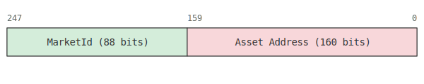

# ReserveKey Encoding

A `ReserveKey` is a unique identifier for a specific asset reserve within a market. It is represented as a `uint248` value and is fundamental to how the protocol organizes and accesses data related to different assets in various markets.

The `ReserveKey` is a composite key derived from two main components: the [`MarketId`](../../src/types/Types.sol) and the asset's `IERC20` contract address. This structure ensures that every reserve can be uniquely identified across the entire protocol.

## Encoding Scheme

The `ReserveKey` is a `uint248` value with the following structure:

- **Bits 247-160 (88 bits)**: Encodes the [`MarketId`](../../src/types/Types.sol), identifying the specific market the reserve belongs to.
- **Bits 159-0 (160 bits)**: Encodes the asset's `IERC20` contract address.

This encoding is performed in the [`ReserveKeyLibrary.sol`](../../src/types/ReserveKey.sol) library, specifically in the `toReserveKey` function. The library also provides helper functions like `getMarketId` and `getAsset` to decode the `MarketId` and asset address from a given `ReserveKey`.

## Relationship with TokenId

The `ReserveKey` is a building block for creating more complex `TokenId`s for reserve tokens (like `LEND`, `DEBT`, and `ESCROW` tokens). As described in the [`TokenIdEncoding.md`](./TokenIdEncoding.md) document, a [`TokenType`](../../src/libraries/TokenHelpers.sol) is combined with the `ReserveKey` to form the final `tokenId` for a reserve token.

For example, the `toLentId` function in [`ReserveKeyLibrary.sol`](../../src/types/ReserveKey.sol) creates a `LEND` token `tokenId` by taking a `ReserveKey` and prepending the `LEND` [`TokenType`](../../src/libraries/TokenHelpers.sol).
