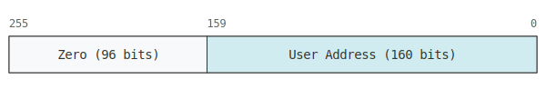
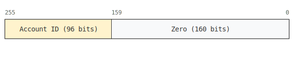
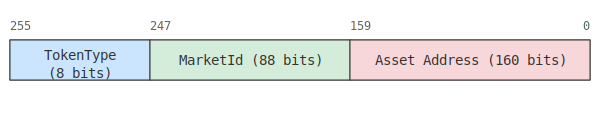

# TokenId Encoding

The protocol uses a `uint256` as a `tokenId` to represent various components in a tokenized manner. Each token type encoding is designed to not clash with others even though all of them are represented as a `uint256`.

This document explains how different components are encoded into a `tokenId`.

## Token Types

The `TokenType` enum defines the various types of tokens that can be represented by a `tokenId`:

- `INVALID`: An invalid token type.
- `ESCROW`: Represents an asset as collateral which is not available for borrowing under any conditions.
- `LEND`: Represents the assets which act as collateral and are also available for borrowing in case the market allows for borrowing it.
- `DEBT`: Represents debt positions.
- `ISOLATED_ACCOUNT`: Represents an isolated account.
- `USER_ACCOUNT`: Represents a user's primary account (default for every public key).

## Encoding Scheme

The `tokenId` is a `uint256` value, and its structure depends on the `TokenType`.

### Account Tokens

Account tokens represent either a user's primary account or an isolated account.

- **User Account Token**:
  - The lower 160 bits represent the user's wallet address.
  - The upper 96 bits are zero.

- **Isolated Account Token**:
  - The lower 160 bits are zero.
  - The upper 96 bits represent a unique account identifier.

The `getTokenType` function in [`TokenHelpers.sol`](../../src/libraries/TokenHelpers.sol) distinguishes between these two account types based on this structure.

### Reserve Tokens

Reserve tokens are associated with a particular market and a specific asset. These tokens can be of type `ESCROW`, `LEND`, or `DEBT`.

The encoding for these tokens is as follows:

- **Bits 255-248 (8 bits)**: Encodes the [`TokenType`](../../src/libraries/TokenHelpers.sol) (e.g., `ESCROW`, `LEND`, `DEBT`).
- **Bits 247-160 (88 bits)**: Encodes the [`MarketId`](../../src/types/Types.sol).
- **Bits 159-0 (160 bits)**: Encodes the asset's [`IERC20`](../../src/interfaces/IERC20.sol) contract address.

This structure allows the protocol to represent a variety of components within a single `uint256` `tokenId`, making it possible to manage different assets and positions in a standardized way.

## Clash Analysis

A potential clash between token types would mean that a `tokenId` for one type could have the same `uint256` value as a `tokenId` for another type. Based on the encoding rules, this is not possible.

### Account Tokens vs. Reserve Tokens

- **User Account Token**: The upper 96 bits are **always zero**.
- **Isolated Account Token**: The lower 160 bits are **always zero**.
- **Reserve Token**: For a valid reserve token, both the upper 96 bits (containing a non-zero `TokenType`) and the lower 160 bits (containing a non-zero asset address) must be non-zero.

This design ensures that the conditions for each token type are mutually exclusive. A `tokenId` cannot simultaneously have its upper 96 bits be zero (a condition for a User Account Token) and non-zero (a condition for a Reserve Token). Similarly, it cannot have its lower 160 bits be zero (for an Isolated Account Token) and non-zero (for a Reserve Token). Therefore, no clashes can occur between account and reserve tokens.

Since an address cannot represent 2 things i.e, an address cannot be both a ERC20 contract address and a user account address, the encoding ensures that the `tokenId` for a User Account Token will never clash with a Reserve Token.